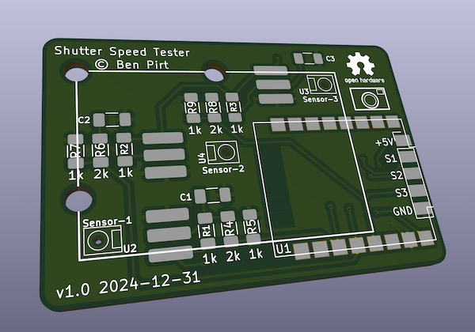
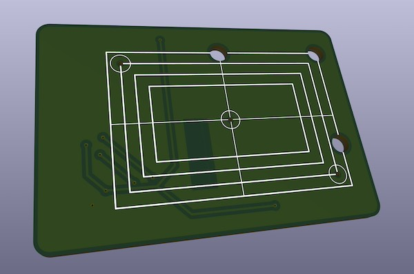
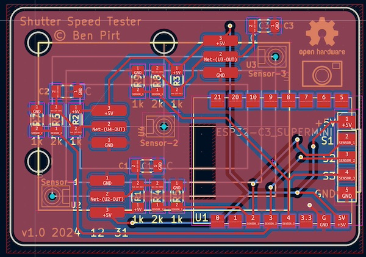
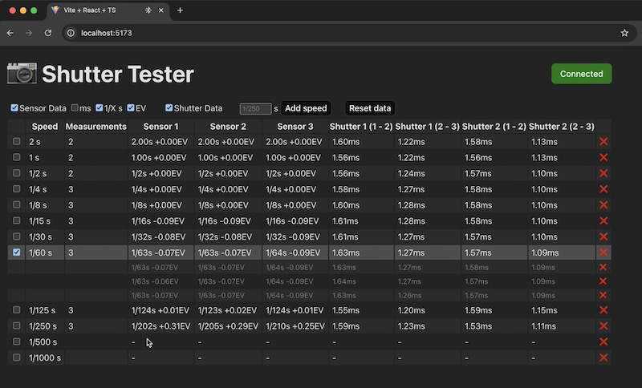

# Shutter Tester

A low cost but capable three-point shutter speed tester that runs on ESP32. It uses the PCB design to provide the physical structure of the tester so that all you need to do is solder it together and all of the mechanical design is taken care of.
It runs on ESP32 so is easily updated using the Arduino platform. The project is 100% open source (see the [license file](LICENSE.md) for details).
The UI runs int he browser and communicates with the shutter tester via Bluetooth - you can try out the UI [here](https://bjpirt.github.io/shutter-tester/?demo=true).

## Design

The design of the shutter tester is quite simple; it uses three IS485E / IS486E light sensors with built-in amplifiers to trigger three digital input interrupts on the ESP32 MCU. I wanted to keep the front side of the PCB clear to avoid it ever scratching the camera body so have opted for using surface mount components. I've used quite large packages for these so that they can be more easily hand soldered. The ESP32 uses an "ESP32 C3 Super Mini" module which is very small, can be surface mounted and has USB C built-in which can be used to power the whole board. I've kept the PCB size down to 50mm so that you can take advantage of low cost PCB fabrication. There are silk-screen markings to help position the tester over the camera shutter and three large holes to help see the edges from behind. It should either be taped in place or held with an elastic band.





Currently the sensor just prints out the shutter timings on the serial console, but there are plans to make this work with a more fully featured web-based tool using the built-in WiFi on the device.

## Bill of materials

The BoM is quite low cost and relatively minimal:

- 1 x ESP32 C3 Super Mini module
- 3 x IS485E light sensor
- 6 x 1k 1206 SMD Resistor
- 3 x 2k 1206 SMD Resistor
- 3 x 0.01uF 1206 SMD Capacitor

## Assembly

The main thing to take care over during assembly is to ensure the lens of the light sensor aligns to the small hole in the PCB that allows the light through. The three legs of the sensor should be bent down slightly so that they can solder onto the three pads on the PCB.

The capacitors and resistors can be easily hand soldered (a finer soldering iron tip helps here) by applying solder to one of the pads on the PCB, using tweezers, solder one end of the component to the soldered pad on the PCB, then solder the other end once it is held in place. If you're experienced in surface mounting you could always use solder paste, but it's pretty straightforward without this. There are markings on the board for which component goes where (C1, C2 and C3 for the capacitors, Resistor values are marked 1k and 2k). The capacitors are optional and may be removed in a future iteration.

It's best to test the ESP32 module before soldering to ensure it's working fine. Program this using the sketch included and make sure it is outputting "Ready to measure" on the serial console (running at 921600 baud).

It's a good idea to place some black insulation tape over the back of the sensors otherwise stray light can cause false readings.

## Usage

Attach the shutter tester behind the shutter of the camera (I normally use 2 - 3 small blobs of Blu-Tak which works well). You can use the three larger holes in the tester to align with the edges of the shutter aperture. Open the shutter once you've this so you can check it's properly positioned by setting the shutter to "Bulb" and opening it. Remove the lens (if possible) and place a strong, even light at the front of the camera. You can use a full size bulb for this so long as it is the type that has a white diffuser bulb, not clear. Basically you want to ensure that light can pass directly through the three holes to reach the sensors, not at an angle. I've also had good results with a small USB powered LED panel.

### Using Bluetooth

There is a user interface that connects to the ESP32 from a Chrome web browser directly and lets you analyse all of the measurements quite easily.



You can easily use the [latest version](https://bjpirt.github.io/shutter-tester/). You should then be able to click the `Connect` button and pair with your shutter tester using Bluetooth. Select the speed you want to test, set up the light and fire the shutter. The new reading should appear in the table.

If you want to just try out the UI without a tester, you can use [this link](https://bjpirt.github.io/shutter-tester/?demo=true) and the "Test" button will simulate a shutter being fired. From a privacy perspective, the UI runs entirely in your browser and nothing goes over the internet.

If you want to run this locally you can do the following:

- Install Node.js (v22)
- Open a terminal in the `ui` folder of this repository
- run `npm install`
- run `npm run dev`
- Go to the URL printed in your terminal ([http://localhost:5173/](http://localhost:5173/))

### Using serial

Open a serial terminal to the ESP32 (this is built in to the Arduino IDE). You'll need to connect at 921600 baud.

Fire the shutter and it will print out the timings to the serial console. There are two sets of timings:

- The time taken for each shutter to travel across the frame - it's important to try and get both shutters moving at around the same speed
- The time each sensor was exposed for in microseconds, milliseconds and fractions of a second

```
Ready to measure

Shutter timing
Shutter 1: 1-2: 16582 uS || 2-3: 12632 uS
Shutter 2: 1-2: 23756 uS || 2-3: 18462 uS

Exposure timing
Sensor 1: 4346 uS || 4.3 mS || 1 / 228
Sensor 2: 5028 uS || 5.0 mS || 1 / 198
Sensor 3: 5528 uS || 5.5 mS || 1 / 182
```

In this example, the time taken for the first shutter to travel between the first and second (centre) sensors was 16582 microseconds and 12632 microseconds between the second (centre) and third sensor. You can see that in this example the second shutter is slow and would need adjusting.

Looking at the exposure time at each sensor, you can see the timings would need adjusting to give a good even exposure. First you would adjust the shutter timings to try and get them similar and then adjust both shutter tensioners to get the exposure time to match the expected (in this case it should have been 1/250 S)

# To Do

- [ ] Calculate variations across shutter and whether they are within tolerances
- [ ] Add graph visualisation of shutter speeds
- [ ] Generate report from three point test
- [x] Enable detailed measurements to be shown / hidden in three point mode
- [x] Deploy to GitHub pages using GitHub actions
- [x] Automatically work out vertical or horizontal shutter
- [x] Display full shutter timing
- [x] Separate shutter timing mode
- [x] Single shot mode (only show last shot timing) - useful for initial tuning
- [x] Compensation for sensor width

## Future

- [ ] Add persistence in the browser to enable common presets to be stored - e.g. camera types with speeds
- [ ] Enable different "runs" to be stored and compared so you can see progression when adjusting
- [ ] Add exposure measurement with light to frequency sensor
- [ ] Investigate reflective measurement from front of camera for e.g. Barnack Leicas
- [ ] Investigate using an analog photodiode instead of a binary sensor
